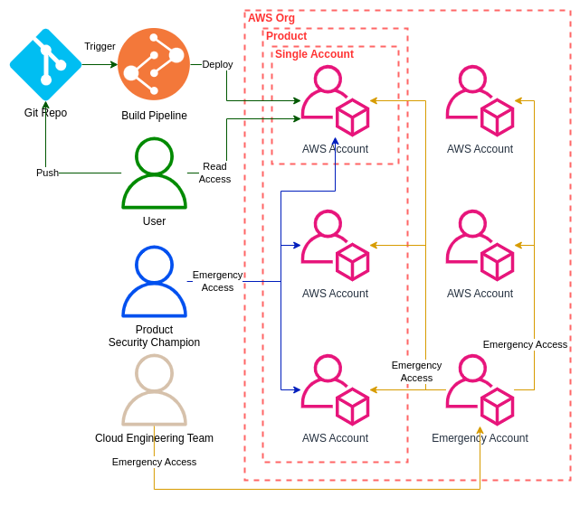

# AWS Organization with Read Only Access

AWS is awesome. With a few clicks its possible to setup a lot of infrastructure without a problem. But is that good? Does that scale?

A normal development team may have 5 to 10 people if not even more. With everyone being able to make changes on the go, it can become hard to track changes and keep documentation up to date. And if something happens? You have to find the person and their changes and revert them.

But there must be a better way! And there is! We can apply what works well for Software Development and use it in Cloud Infrastructure. 

Instead of everyone being able to change everything at anytime, we make sure that everything is deployed via CI and users are getting restricted read only roles. With Mandatory Code Reviews we can make sure that another pair of eyes takes a look and with Infrastructure Tests we can make sure that everything keeps working as expected. 

What is the result of that?

* Engineers develop trust in the System<br />With tests and stages, Engineers learn that they are allowed to make mistakes and can fix them before anything happens in Prod. 
* The code is the documentation<br />Instead of having to write documentation, which then becomes obsolete, the code is the documentation. And it will change whenever something in the Infrastructure changes.
* Clear Development Flow<br />Instead of knowing how to deploy something, CI does everything for you. It tests your code, checks for problems and makes sure that it is deployed in a specific way.
* Easy to find who changed something<br />With git its easy to find out who changed something and when. This way its easy to know, to whom to go, for clarifications.

To get this up and running we will follow this AWS Organization structure:



We will take a look at:
* How to setup Read Only Access (This Part)
* How to setup CI Deployment (Part 2)
* How to implement Emergency Access (Part 3)
* How to support testing a branch (Part 4)
* How to deploy Secrets (Part 5)

Adding the Read Only Access in AWS CDK is easy. All thats necessary is a new Permission Set for AWS IAM Identity Center which then needs to be connected to every AWS Account.

Most Organizations use Control Tower or a dedicated Pipeline to deploy these changes. In CDK this would look something like this:

```typescript
class OrganizationSsoStack extends cdk.Stack {
  constructor(scope: Construct, id: string, props: cdk.StackProps) {
    super(scope, id, props);

    const ssoInstanceArn = this.getSsoInstanceArn();
    const permissionSetArn = this.createRestrictedRole(ssoInstanceArn);
    this.assignToAccount(ssoInstanceArn, permissionSetArn);
  }

  getSsoInstanceArn(): string {
    const resource = new custom_resources.AwsCustomResource(
      this,
      "SsoInstance",
      {
        logRetention: logs.RetentionDays.ONE_MONTH,
        onCreate: {
          action: "listInstances",
          service: "SSOAdmin",
          parameters: {},
          physicalResourceId:
            custom_resources.PhysicalResourceId.of("SsoInstance"),
        },
        policy: custom_resources.AwsCustomResourcePolicy.fromStatements([
          new iam.PolicyStatement({
            actions: ["sso:ListInstances"],
            resources: ["*"],
          }),
        ]),
        resourceType: "Custom::SsoInstance",
        timeout: cdk.Duration.minutes(5),
      },
    );
    return resource.getResponseField("Instances.0.InstanceArn");
  }

  createRestrictedRole(ssoInstanceArn: string) {
    const permissionSet = new cdk.aws_sso.CfnPermissionSet(
      this,
      "RestrictedAccess",
      {
        instanceArn: ssoInstanceArn,
        name: "RestrictedAccess",

        description:
          "Provides mostly read only access to user for day to day access",
        inlinePolicy: new iam.PolicyDocument({
          statements: [
            new iam.PolicyStatement({
              resources: ["*"],
              actions: [
                // Additional Actions to allow like Lambda Invoke
              ],
            }),
          ],
        }).toJSON(),
        managedPolicies: [
          iam.ManagedPolicy.fromAwsManagedPolicyName("ReadOnlyAccess"),
        ].map((policy) => policy.managedPolicyArn),
        sessionDuration: `PT${cdk.Duration.hours(8).toHours()}H`,
        tags: Object.entries(cdk.Stack.of(this).tags.tagValues()).map(
          ([key, value]) => ({
            key,
            value,
          }),
        ),
      },
    );
    permissionSet.applyRemovalPolicy(cdk.RemovalPolicy.DESTROY);
    return permissionSet.attrPermissionSetArn;
  }

  assignToAccount(ssoInstanceArn: string, permissionSetArn: string) {
    const assignment = new cdk.aws_sso.CfnAssignment(this, "SsoAssignment", {
      instanceArn: ssoInstanceArn,
      permissionSetArn: permissionSetArn,
      principalId: "<USER|GROUP ID>",
      principalType: "<USER|GROUP>",
      targetId: "<ACCOUNT ID>",
      targetType: "AWS_ACCOUNT",
    });
    assignment.applyRemovalPolicy(cdk.RemovalPolicy.DESTROY);
  }
}
```

With this in place, users can directly access the AWS Account without being able to change anything. And if we need to add a few additional Permissions, like running a Lambda or performing a few maintaince Operations, like deleting S3 Objects, then we can add them to the Policy too. But we should make sure to limit the additional Permissions to encourage using the Git Repository for changes.

Stay tuned for the next parts and as always, let me know what you think! Also feel free to checkout the full Source Code on [github](https://github.com/itmettkeDE/blog/blob/main/2024-01-12/).
