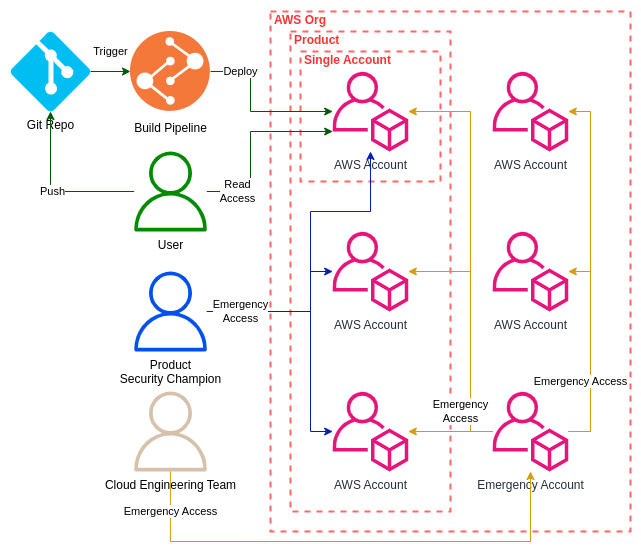

# AWS Cross-Account Emergency Access

In the last Parts, we had a look at how to improve [Infrastructure reliability by only using Read Only Access](https://www.linkedin.com/pulse/aws-organization-read-only-access-marc-mettke-5gaae/) and how to [Deploy AWS CDK via GitHub Actions](https://www.linkedin.com/pulse/ci-infrastructure-deployment-aws-marc-mettke-cange/).

But an important point still left open is how to perform changes in an emergency when quick reactions are important and necessary. While we do want to reduce these situations as much as possible to prevent our Infrastructure from deriving from the Software Defined Setup, we cannot afford to not be able to react.

And we also do not have to. Because AWS does provide easy ways to give certain people elevated access permissions for one or more Accounts. Let's take a look at how to build that using this structure:



There are three teams with three different Requirements. The User is already implemented, leaving the Product Security Champion who needs Emergency Access to all the Accounts of the Product that he supervises, and the Cloud Engineering Team which wants to quickly act if their intervention is required.

In the first step, we will create the required Access for the Product Security Champion. We need a new AWS Identity Center Permission Set:

```typescript
  createEmergencyAccessRoleForTeams(ssoInstanceArn: string) {
    const permissionSet = new cdk.aws_sso.CfnPermissionSet(
      this,
      "EmergencyAccessForTeams",
      {
        instanceArn: ssoInstanceArn,
        name: "EmergencyAccessForTeams",

        description:
          "Provides Write permissions for specific users to allow performing changes in energencies",
        managedPolicies: [
          iam.ManagedPolicy.fromAwsManagedPolicyName("AdministratorAccess"),
        ].map((policy) => policy.managedPolicyArn),
        sessionDuration: `PT${cdk.Duration.hours(1).toHours()}H`,
        tags: Object.entries(cdk.Stack.of(this).tags.tagValues()).map(
          ([key, value]) => ({
            key,
            value,
          }),
        ),
      },
    );
    permissionSet.applyRemovalPolicy(cdk.RemovalPolicy.DESTROY);
    return permissionSet.attrPermissionSetArn;
  }
```

This Permission Set is connected directly to Accounts which have a Product Security Champion that needs access. They provide direct Write Access to all Services in that Accounts.

The second Permission Set is for the Cloud Engineering Team:

```typescript
  createEmergencyAccessRoleForGlobalAccess(ssoInstanceArn: string) {
    const permissionSet = new cdk.aws_sso.CfnPermissionSet(
      this,
      "OrgEmergencyAccess",
      {
        instanceArn: ssoInstanceArn,
        name: "OrgEmergencyAccess",

        description:
          "Allows to assume an Emergency Access Role in any Account of the Organization",
        inlinePolicy: new iam.PolicyDocument({
          statements: [
            new iam.PolicyStatement({
              resources: [`arn:aws:iam::*:role/OrgEmergencyAccess`],
              actions: ["sts:AssumeRole"],
            }),
          ],
        }),
        sessionDuration: `PT${cdk.Duration.hours(1).toHours()}H`,
        tags: Object.entries(cdk.Stack.of(this).tags.tagValues()).map(
          ([key, value]) => ({
            key,
            value,
          }),
        ),
      },
    );
    permissionSet.applyRemovalPolicy(cdk.RemovalPolicy.DESTROY);
    return permissionSet.attrPermissionSetArn;
  }
```

In contrast to the first Permission Set, this one is only connected to a special `Emergency Access` Account and only allows one to assume another Role. This Role will be deployed to every Account in the Organization using a Cloudformation StackSet. To connect those two, we use this function:

```typescript
  assignToAccount(
    ssoInstanceArn: string,
    permissionSetArn: string,
    id: string,
  ) {
    const assignment = new cdk.aws_sso.CfnAssignment(
      this,
      `SsoAssignment-${id}`,
      {
        instanceArn: ssoInstanceArn,
        permissionSetArn: permissionSetArn,
        principalId: "<USER|GROUP ID>",
        principalType: "<USER|GROUP>",
        targetId: "<ACCOUNT ID>",
        targetType: "AWS_ACCOUNT",
      },
    );
    assignment.applyRemovalPolicy(cdk.RemovalPolicy.DESTROY);
  }
```

And then we can connect it like this:

```typescript
class OrganizationSsoStack extends cdk.Stack {
  constructor(scope: Construct, id: string, props: cdk.StackProps) {
    super(scope, id, props);

    const ssoInstanceArn = this.getSsoInstanceArn();

    // This Permission Set is for the Product Champion. Its connected to all Account
    // Stages like dev, test and prod and the product champion will be the on to get
    // access.
    const permissionSetArn =
      this.createEmergencyAccessRoleForTeams(ssoInstanceArn);
    this.assignToAccount(
      ssoInstanceArn,
      permissionSetArn,
      "EmergencyAccessRoleForTeams",
    );

    // This Permission Set is for the Cloud Engineering Team. It allows write access
    // to any Account to perform changes in emergencies. Its connected only to the
    // Emergency Account and the cloud engineers who are allowed to use it.
    const permissionSetArnGlobal =
      this.createEmergencyAccessRoleForGlobalAccess(ssoInstanceArn);
    this.assignToAccount(
      ssoInstanceArn,
      permissionSetArnGlobal,
      "EmergencyAccessRoleForGlobalAccess",
    );
  }
}
```

The last thing left to do is to provide the Role for the Emergency Access required by the Cloud Engineering Team. For this, we will create this [StackSet](https://www.linkedin.com/pulse/stacksets-cdk-marc-mettke-yezhe/):

```typescript
interface OrganizationAccountsStackSetProps
  extends stacksets.ManagedStackSetStackProps {
  emergencyAccountId: string;
}

export class OrganizationAccountsStackSet extends stacksets.ManagedStackSetStack {
  constructor(
    scope: Construct,
    id: string,
    props: OrganizationAccountsStackSetProps,
  ) {
    super(scope, id, props);

    const role = new iam.Role(scope, "EmergencyRole", {
      assumedBy: new iam.AccountPrincipal(
        props.emergencyAccountId,
      ).withConditions({
        ArnLike: {
          "aws:PrincipalArn": [
            `arn:aws:iam::${props.emergencyAccountId}:role/aws-reserved/sso.amazonaws.com/*/AWSReservedSSO_OrgEmergencyAccess_*`,
          ],
        },
      }),
      roleName: "OrgEmergencyAccess",
    });
    role.addManagedPolicy(
      iam.ManagedPolicy.fromAwsManagedPolicyName("AdministratorAccess"),
    );
  }
}
```

Now the foundation is available. We limited the Permissions for most Users and provided special Roles to be able to act in Emergencies. Now the only things left are these:

* How to test the Infrastructure before it is deployed to main. It's not worth anything if a single merged PR breaks everything. Thats for Part 4
* AWS CDK is not very good with Secrets. Making sure that we can deploy those without making changes manually is for Part 5.

As always the code for this setup is available on [GitHub](https://github.com/itmettkeDE/blog/blob/main/2024-01-26/). Feel free to check it out!
